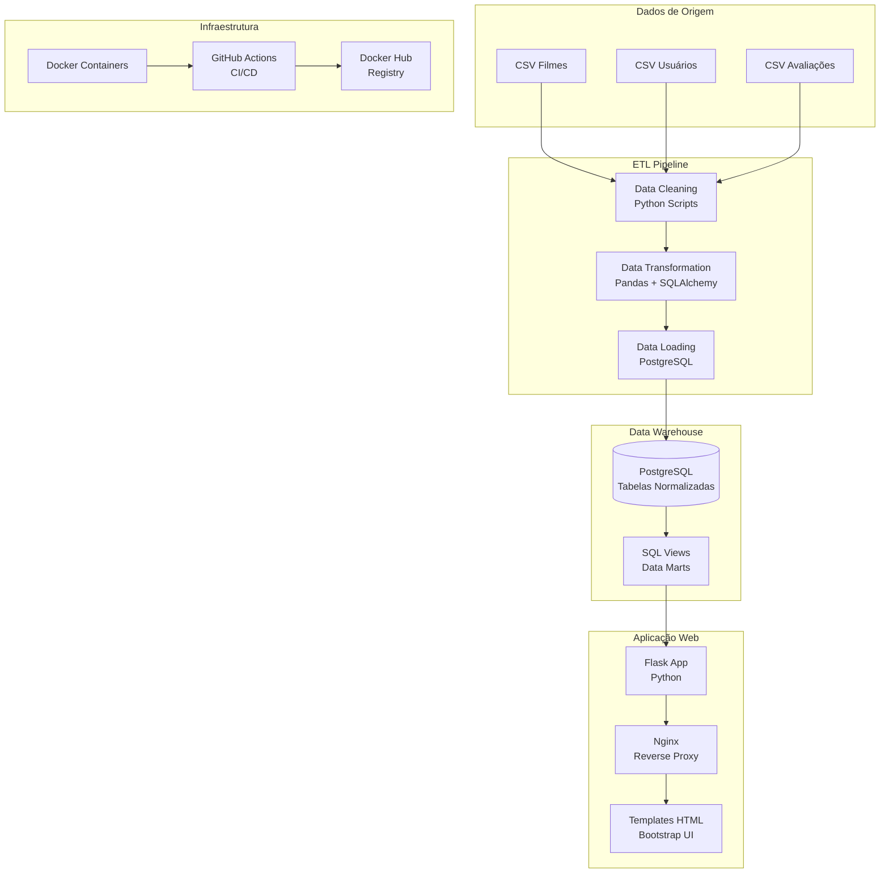

# 🎬 ProjetoFinal-ETL - Sistema de Avaliação de Filmes

[](https://github.com/leolage182/ProjetoFinal-ETL/actions)
[](https://hub.docker.com/r/leonardo148/movie-rating-app)

Sistema completo de ETL (Extract, Transform, Load) para análise de dados de filmes e avaliações de usuários, com interface web para visualização de Data Marts e dashboards analíticos.

## 📋 Índice

- [Arquitetura do Sistema](#-arquitetura-do-sistema)
- [Tecnologias Utilizadas](#-tecnologias-utilizadas)
- [Estrutura do Projeto](#-estrutura-do-projeto)
- [Pipeline ETL](#-pipeline-etl)
- [Data Marts](#-data-marts)
- [Instalação e Execução](#-instalação-e-execução)
- [API Endpoints](#-api-endpoints)
- [CI/CD com GitHub Actions](#-cicd-com-github-actions)
- [Demonstração](#-demonstração)

## 🏗️ Arquitetura do Sistema



### Componentes Principais

1. **ETL Pipeline**: Processamento automatizado de dados CSV
2. **Data Warehouse**: PostgreSQL com tabelas normalizadas e views otimizadas
3. **Web Application**: Interface Flask com dashboards interativos
4. **Containerização**: Docker para portabilidade e escalabilidade
5. **CI/CD**: GitHub Actions para automação de deploy

## 🛠️ Tecnologias Utilizadas

### Backend
- **Python 3.11**: Linguagem principal
- **Flask**: Framework web
- **Pandas**: Manipulação de dados
- **SQLAlchemy**: ORM e conexão com banco
- **psycopg2**: Driver PostgreSQL

### Banco de Dados
- **PostgreSQL 15**: Data Warehouse principal
- **SQL Views**: Data Marts otimizados

### Frontend
- **HTML5/CSS3**: Interface web
- **Bootstrap 5**: Framework CSS responsivo
- **Jinja2**: Template engine

### DevOps
- **Docker & Docker Compose**: Containerização
- **GitHub Actions**: CI/CD pipeline
- **Nginx**: Reverse proxy e load balancer

## 📁 Estrutura do Projeto

```
etl/
├── 📄 docker-compose.yml          # Orquestração de containers
├── 📊 *.csv                      # Dados brutos e limpos
│
├── 🐳 etl-data-cleaning/         # Container de limpeza de dados
│   ├── 📄 Dockerfile-dados01
│   ├── 🐍 run_all_cleaning.py    # Orquestrador de limpeza
│   ├── 🐍 etl01                  # Limpeza de filmes
│   ├── 🐍 usuarios_cleaning.py   # Limpeza de usuários
│   └── 🐍 avaliacoes_cleaning.py # Limpeza de avaliações
│
├── 🐳 etl-postgres/              # Container ETL principal
│   ├── 📄 Dockerfile
│   └── 🐍 etl_com_postgres.py    # ETL completo + Data Marts
│
├── 🐳 movie-app/                 # Container da aplicação web
│   ├── 📄 Dockerfile
│   ├── 📄 nginx.conf             # Configuração Nginx
│   ├── 🐍 app.py                 # Aplicação Flask
│   └── 📁 templates/             # Templates HTML
│       ├── 🏠 index.html
│       ├── 👥 usuarios.html
│       ├── 🎬 filmes.html
│       ├── ⭐ avaliacoes.html
│       └── 📊 data_marts.html
│
└── 🔄 .github/workflows/         # GitHub Actions
    └── 📄 ci-cd.yml
```

## 🔄 Pipeline ETL

### 1. Extract (Extração)
- **Fonte**: Arquivos CSV com dados brutos
  - `filmes_raw.csv`: Catálogo de filmes
  - `usuarios_raw.csv`: Base de usuários
  - `avaliacoes_raw.csv`: Avaliações dos usuários

### 2. Transform (Transformação)
```python
# Limpeza e padronização
- Remoção de duplicatas
- Tratamento de valores nulos
- Normalização de texto (remoção de acentos)
- Validação de tipos de dados
- Padronização de colunas
```

### 3. Load (Carregamento)
```sql
-- Estrutura do Data Warehouse
CREATE TABLE filmes (
    id SERIAL PRIMARY KEY,
    titulo TEXT,
    ano_lancamento INTEGER,
    genero TEXT,
    nota_imdb REAL
);

CREATE TABLE usuarios (
    id SERIAL PRIMARY KEY,
    nome TEXT,
    email TEXT,
    genero TEXT,
    pais TEXT
);

CREATE TABLE avaliacoes (
    id SERIAL PRIMARY KEY,
    user_id INTEGER REFERENCES usuarios(id),
    filme_titulo VARCHAR(500),
    nota DECIMAL(3,1),
    comentario TEXT,
    data_avaliacao TIMESTAMP DEFAULT CURRENT_TIMESTAMP
);
```

## 💼 Justificativas de Negócio

**Inteligência de Mercado**: Permite a rápida identificação de tendências de consumo e preferências de conteúdo (Top Filmes por Gênero, Filmes Mais Populares/Odiados), direcionando estratégias de aquisição e marketing.

**Engajamento do Cliente**: Facilita a identificação dos usuários mais engajados (Top Usuários Avaliadores), criando oportunidades para programas de fidelidade e marketing de comunidade.

**Otimização de Conteúdo**: Ajuda a compreender a performance do catálogo em diferentes segmentos (Nota Média por Gênero, Avaliações por País), auxiliando na curadoria e na gestão de conteúdo.

## 📊 Data Marts

### Views Analíticas Implementadas

1. **🏆 Top Filmes por Gênero**


2. **👑 Top Usuários Avaliadores**

3. **📉 Piores Filmes por Gênero**
4. **🌍 Avaliações por País**
5. **📈 Nota Média por Gênero**

### Consultas Analíticas Específicas
- **🔥 Top 5 Filmes Mais Populares**
- **📊 Número de Filmes Avaliados por Usuário**
- **💔 Top 5 Filmes Mais Odiados**

## 🚀 Instalação e Execução

### Pré-requisitos
- Docker 20.10+
- Docker Compose 2.0+
- Git

### Execução Local

1. **Clone o repositório**
   ```bash
   git clone https://github.com/leolage182/ProjetoFinal-ETL.git
   cd ProjetoFinal-ETL
   ```

2. **Execute o pipeline completo**
   ```bash
   docker-compose up --build
   ```

3. **Acesse a aplicação**
   - **Web App**: http://localhost
   - **API**: http://localhost/api/filmes

### Limpeza e Reinicialização

Para rodar novamente ou limpar os dados:

```bash
# Para o ambiente e remove volumes (limpa dados do PostgreSQL)
docker-compose down -v

# Remove também as imagens (opcional)
docker-compose down -v --rmi all

# Para rodar novamente do zero
docker-compose up --build
```

## 🔌 API Endpoints

### Páginas Web
- `GET /` - Página inicial
- `GET /usuarios` - Lista de usuários
- `GET /filmes` - Catálogo de filmes
- `GET /avaliacoes` - Todas as avaliações
- `GET /data-marts` - Dashboard principal

### Data Marts
- `GET /data-marts/top-filmes-por-genero`
- `GET /data-marts/top-usuarios-avaliacoes`
- `GET /data-marts/piores-filmes-por-genero`
- `GET /data-marts/avaliacoes-por-pais`
- `GET /data-marts/nota-media-por-genero`

### API REST
- `GET /api/filmes` - JSON com todos os filmes

### Formulários
- `POST /cadastrar_usuario` - Cadastro de usuário
- `POST /avaliar_filme` - Nova avaliação

## ⚙️ CI/CD com GitHub Actions

### Pipeline Automatizado

```yaml
# .github/workflows/ci-cd.yml
name: CI/CD Pipeline

on:
  push:
    branches: [ main ]
  pull_request:
    branches: [ main ]

jobs:
  test:
    runs-on: ubuntu-latest
    steps:
      - uses: actions/checkout@v3
      - name: Run ETL Tests
        run: docker-compose -f docker-compose.test.yml up --abort-on-container-exit

  build-and-push:
    needs: test
    runs-on: ubuntu-latest
    steps:
      - name: Build and Push to Docker Hub
        uses: docker/build-push-action@v3
        with:
          push: true
          tags: leolage182/movie-rating-app:latest
```

### Funcionalidades do Pipeline
- ✅ **Testes automatizados** do pipeline ETL
- 🐳 **Build automático** das imagens Docker
- 📦 **Push automático** para Docker Hub
- 🚀 **Deploy automático** em ambiente de produção

## 📈 Monitoramento e Logs

### Logs Estruturados
```bash
# Visualizar logs em tempo real
docker-compose logs -f

# Logs específicos por serviço
docker-compose logs movie-app
docker-compose logs pg-dados
docker-compose logs etl-data-cleaning
```
## 👨‍💻 Autor

**Leonardo Lage**
- GitHub: [@leolage182](https://github.com/leolage182)
- LinkedIn: [Leonardo Lage](https://www.linkedin.com/in/leonardo-lage-016568194/)

---
